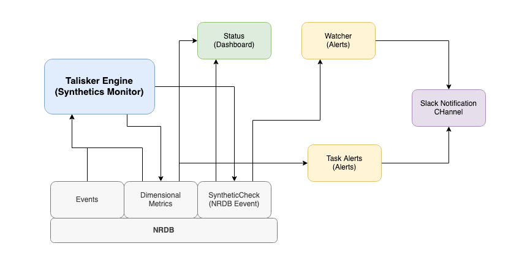

[](https://opensource.newrelic.com/oss-category/#new-relic-experimental)

# Talisker - NRDB NRQL Alerting Engine
The Talisker engine allows you to alert on NRQL queries longer than the 24 hour streaming alerts limit. The engine runs within the New Relic Synthetic Monitor container and can be configured with a simple JSON configuration. This allows you to query against NRDB using any time window span you choose and also combine results from multiple queries. Query results are written back to NRDB where you can alert on them.

At its simplest you can just add the [script](./modules/Talisker/src/base_script.js) to your synthetic monitor, but this project includes a full terraform module that builds not only the monitor but a dashboard and default alerts too. You might not want all of that cruft, simply remove what you dont need.

## Installation and setup
You can run the script stand alone in a synthetic, locally on your machine or setup a more comprehensive monitored application:

### Stand alone mode 
For stand mode, alone copy the content of [base_script.js](./modules/Talisker/src/base_script.js) into a New Relic API monitor. Un-comment the top block and set the values as required. Details on task settings can be found below.

Set the monitor name and ID as approriate for the monitor you have set the script up in. You could use any ID and name you like too, this only really matters if you;re running more than one instance in an account.

You will need to specify two API keys, one a user key api and one ingest insert key. These are to query and inject the data respectively. We recommend that you store these in the secure credential store.


### Terraform application mode
This project includes a terraform module that makes it easy to setup both the script and also some monitoring of the script. It creates a dashboard, the secure credentials, some alerts (one for the engine, one for all the tasks) and as an example a slack notification channel. You can ammend as you see fit. The venefit of this approach is that it builds some alerts and dashbaords that monitor the Talisker engine itself.



To use the terraform version you need to supply the various API keys and data. Copy the `[runtf.sh.sample](runtf.sh.sample)` to `run.tf` and add the values as follows:

- **terraformNRAccountId**: The account ID that the monitor should reside.
- **terraformAPIKey**: A user API key that has rights to create dashboards, alerts, etc resources. (NRAK-...)
- **userAPIKey**: Another user API key that has query rights (NRAK-...)
- **insertAPIKey**: An ingest insert key (NRII-...)
- **slackChannelURL**: A slack webhook url
- **dataCenter**: New Relic data center that your accont resides in, US or EU

In the main.tf setup the tasks as described below.

### Running locally mode
You can run and test on your local machine. With nodejs installed run `npm install` in the `modules/Talisker/src` fodler to install dependencies. Then edit the file accordingly (adding your own API keys where approriate in the local config section and setting up your tasks manually). Run the sript with `node base_script.js` 

## Task configuration
In stand alone mode you configure tasks through the TASKS json object. For terraform you configure the tasks in the main.tf. The terraform version allows you to specify alert criteria for the data too but for the stand alone mode you'll need to setup your own alerts.

Each task you can specify:

- **id**: A unique id for this task in this task list
- **name**: A more friendly readable name for the task
- **accountId**: The account ID to run the query against
- **query**: The NRQL to run. Its best to name your return value using the `as` operator. e.g. `FROM Public_APICall select count(*) as value since 1 day ago compare with 1 week ago`. Note that `compare with` queries are automaticlly recognised and the percentage change is returned. Facets are supported, each result will be reported as a seperate metric value with the facet added as an attribute.
- **selector**: The name of the field contianing the data. e.g. 'value'. This supports dot notation, e.g to reference the value of `..percentile(duration,95) as value...` you would set the selector to  `value.95`
- **chaining**: one of:
  - `NONE`: Just return the value from query
  - `DIFF`: Return the difference from the value from this query to the previous task
  - `PERC_DIFF`: Return the difference from the value from this query to the previous task as a percentage
- **fillNullValue**: The value to use for null results, usually zero.
- **invertResult**: Should the result be inverted? true|false (Alerts can only be set on positive values so this allows you to invert the result and alert upon it.)
- **ingestType**: Type of ingest storage for this task. Metric is default and preferred but storing as events can be usefule. Possible values:  "metric" or "event"

Additionally these settings should be set in terraform to control the alert conditions: (each task becomes a single condition in an single alert policy)

- **alert_operator**
- **alert_critical_threshold**
- **alert_warning_threshold**
- **alert_threshold_occurrences**
- **enabled**: true|false - if false then condition is created but not enabled

Consult the [New Relic Terraform provider documentation](https://registry.terraform.io/providers/newrelic/newrelic/latest/docs/resources/nrql_alert_condition) for a guide on the values for these fields.

Example JSON config:

```javascript
const TASKS = [{
    "id":"example",
    "name":"Example",
    "accountId":"123456",
    "selector":"value",
    "chaining":"NONE",
    "fillNullValue": 0,
    "invertResult": false,
    "ingestType": "metric",
    "query":"FROM Public_APICall select uniqueCount(api) as value since 1 day ago"
}]
```

## Metrics created by Talisker
The script will process each task in the TASKS array and drop a metric into New Relic via the metrics API. Each metric has the form:

- **taslisker.value** - the value thats returned by your query
- **talisker.id** - the id of the task
- **talisker.name** - the name of the task
- **talisker.monitorName** - the name of the monitor (as set by you)

You could for example target the output of a task with the following NRQL: 
`from Metric select latest(talisker.value) where talisker.monitorName='your-monitor-name' and talisker.id='your-task-id`

### Event Support
Talisker also supports storing the output results as events rather than metrics. This can be chosen on a task level by setting `ingestType` to `event`. Events will appear in the event type `taliskerSample`. e.g.: `select latest(value) from taliskerSample facet talisker.name`

## Support

New Relic has open-sourced this project. This project is provided AS-IS WITHOUT WARRANTY OR DEDICATED SUPPORT. Issues and contributions should be reported to the project here on GitHub.

>We encourage you to bring your experiences and questions to the [Explorers Hub](https://discuss.newrelic.com) where our community members collaborate on solutions and new ideas.


## Contributing

We encourage your contributions to improve [Project Name]! Keep in mind when you submit your pull request, you'll need to sign the CLA via the click-through using CLA-Assistant. You only have to sign the CLA one time per project. If you have any questions, or to execute our corporate CLA, required if your contribution is on behalf of a company, please drop us an email at opensource@newrelic.com.

**A note about vulnerabilities**

As noted in our [security policy](../../security/policy), New Relic is committed to the privacy and security of our customers and their data. We believe that providing coordinated disclosure by security researchers and engaging with the security community are important means to achieve our security goals.

If you believe you have found a security vulnerability in this project or any of New Relic's products or websites, we welcome and greatly appreciate you reporting it to New Relic through [HackerOne](https://hackerone.com/newrelic).

## License

Talisker is licensed under the [Apache 2.0](http://apache.org/licenses/LICENSE-2.0.txt) License.

